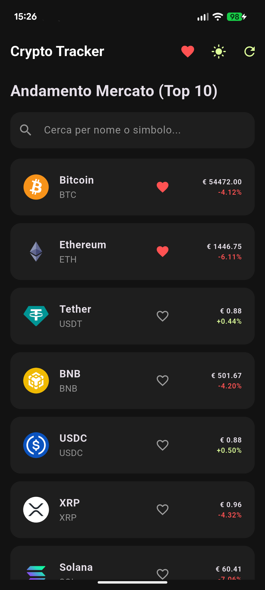
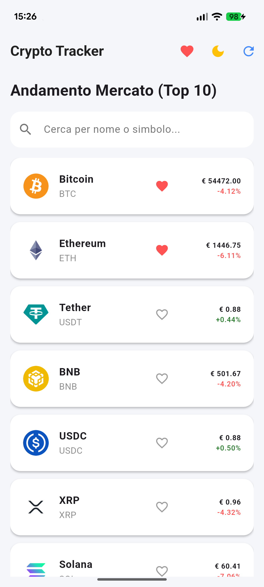
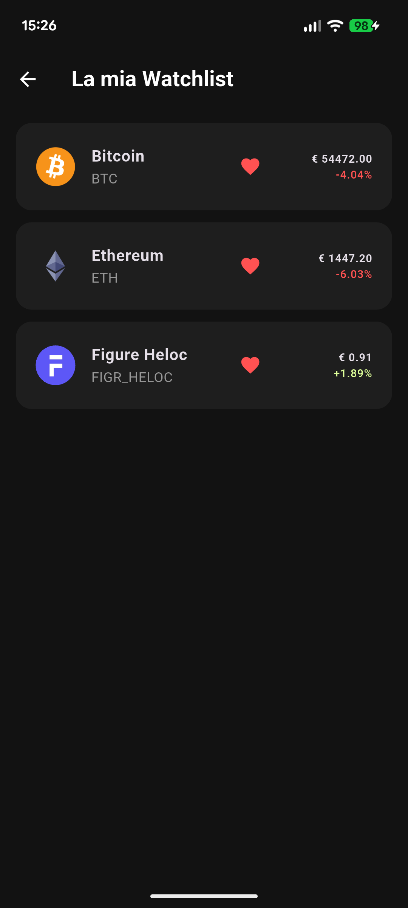
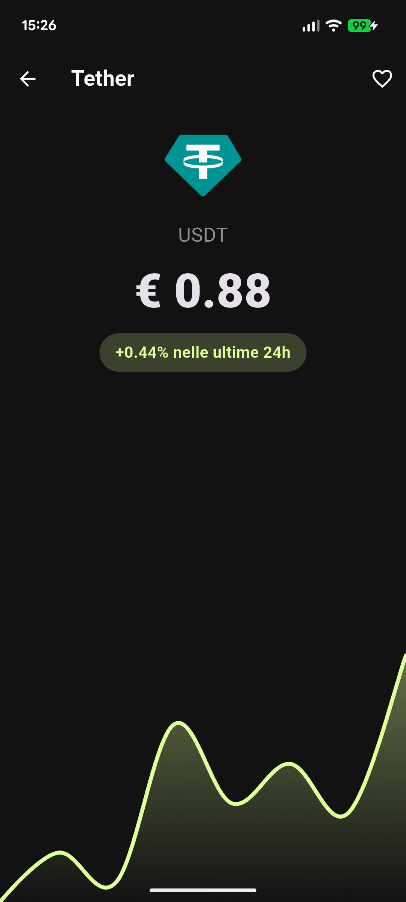
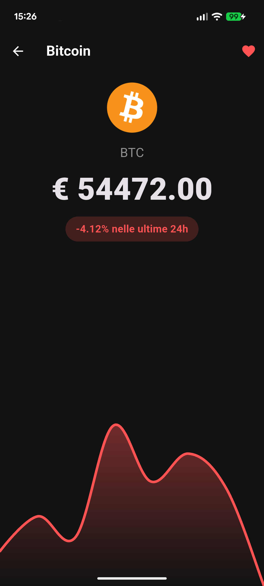
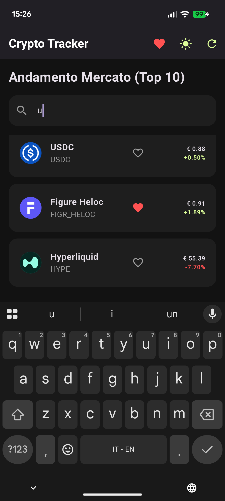

# 📈 Crypto Tracker App

A clean, responsive mobile application built with Flutter and Dart to track cryptocurrency markets in real-time. This application was developed as a hands-on showcase project to consolidate mobile development skills, focusing on state management, secure data persistence, and REST API integration.

## ✨ Key Features
* **Real-Time Data:** Fetches and displays the top 10 cryptocurrencies by market capitalization using the CoinGecko API.
* **Search & Filter:** Instantly filter coins by name or ticker symbol.
* **Secure Watchlist:** Add coins to a favorites list. The state is securely persisted on the device using encrypted local storage.
* **Dynamic Theming:** Seamless toggle between Light and Dark mode, with user preference saved persistently.
* **Interactive UI:** Includes detailed screens with interactive line charts mapping the 24-hour price trends.

## 🛠️ Tech Stack & Architecture
* **Framework:** Flutter
* **Language:** Dart
* **State Management:** Provider (`ChangeNotifier`)
* **API / Networking:** `http` package
* **Local Storage:** `flutter_secure_storage` (AES encryption for Android, Keychain for iOS)
* **Data Visualization:** `fl_chart`


## 🚀 How to run the project
1. Clone the repository:
   ```bash
   git clone [https://github.com/emanuele400tt/crypto-tracker-app.git](https://github.com/emanuele400tt/crypto-tracker-app.git)
2. Install dependencies 
    ```bash
    flutter pub get
3. Run the app 
    ```bash
    flutter run

## App Preview
## Android 

|  
|  
|  
|  
|  
|  | 

## Linux 
|  
|  
|  
|  
|  
|  |

## Chrome 
|  
|  
|  |


# Versione Italiana

Un'applicazione mobile dal design pulito e responsivo, sviluppata con Flutter e Dart per monitorare i mercati delle criptovalute in tempo reale. Questo progetto è stato realizzato come applicazione "vetrina" per mettere in pratica e consolidare le competenze nello sviluppo mobile, con un focus specifico sulla gestione dello stato, la persistenza sicura dei dati e l'integrazione di API REST.

## ✨ Funzionalità Principali
* **Dati in Tempo Reale:** Recupera e mostra le prime 10 criptovalute per capitalizzazione di mercato utilizzando l'API pubblica di CoinGecko.
* **Ricerca e Filtro:** Permette di cercare e filtrare istantaneamente le monete per nome o simbolo (ticker).
* **Watchlist Sicura:** Aggiunta delle monete a una lista di preferiti. Il salvataggio dello stato avviene in modo sicuro sul dispositivo tramite memoria locale crittografata.
* **Tema Dinamico:** Passaggio fluido tra la modalità Chiara e Scura, con salvataggio persistente delle preferenze dell'utente.
* **Interfaccia Interattiva:** Schermate di dettaglio che includono grafici a linee interattivi per mappare l'andamento dei prezzi nelle ultime 24 ore.

## 🛠️ Stack Tecnologico e Architettura
* **Framework:** Flutter
* **Linguaggio:** Dart
* **Gestione dello Stato:** Provider (`ChangeNotifier`)
* **API / Networking:** pacchetto `http`
* **Storage Locale:** `flutter_secure_storage` (Crittografia AES per Android, Keychain per iOS)
* **Visualizzazione Dati:** `fl_chart`

* ## 🚀 Come lanciare il progetto
1. Clonare il repository:
   ```bash
   git clone [https://github.com/emanuele400tt/crypto-tracker-app.git](https://github.com/emanuele400tt/crypto-tracker-app.git)
2. Installa le dipendenze 
    ```bash
    flutter pub get
3. Avvia l'app
    ```bash
    flutter run
